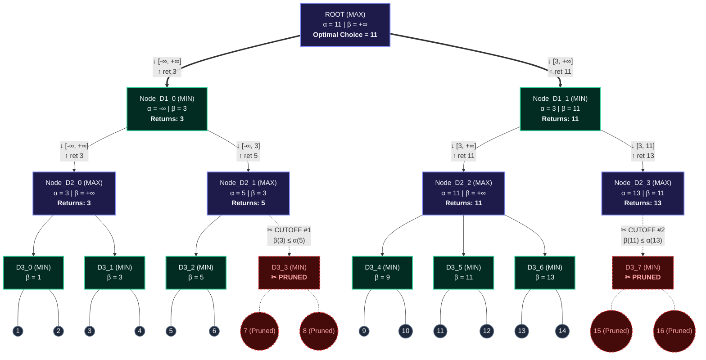

Here is the complete, manual step-by-step dry run using the simple sequential input values from **1 to 16**:

$$[1, 2, 3, 4, 5, 6, 7, 8, 9, 10, 11, 12, 13, 14, 15, 16]$$

---

### Tree Specifications & Level Roles

* **Depth / Ply:** $4$ ($2^4 = 16$ terminal leaves)


* **Branching Factor:** $2$ (Binary Tree)
* **Initial Bounds at Root:** $\alpha = -\infty$, $\beta = +\infty$
* **Level Roles:**
* **Depth 0:** `MAX` (Root)


* **Depth 1:** `MIN` (`Node_D1_0`, `Node_D1_1`)


* **Depth 2:** `MAX` (`Node_D2_0` to `Node_D2_3`)
* **Depth 3:** `MIN` (`Node_D3_0` to `Node_D3_7`)
* **Depth 4:** Terminal Leaves ($1$ to $16$)


---

### Step-by-Step Execution Trace

#### Part 1: Exploring the Left Half of the Tree (`Node_D1_0`)

The algorithm starts at the Root (`MAX`) and traverses down the leftmost path:
`Node_D0_0 (MAX)` $\rightarrow$ `Node_D1_0 (MIN)` $\rightarrow$ `Node_D2_0 (MAX)` $\rightarrow$ `Node_D3_0 (MIN)`.

##### 1. `Node_D3_0` (MIN Node)

* Receives $\alpha = -\infty, \beta = +\infty$.
* Evaluates leaf **`1`**: Updates $\beta = \min(+\infty, 1) = 1$.
* Evaluates leaf **`2`**: Updates $\beta = \min(1, 2) = 1$.
* Returns **$1$** to parent `Node_D2_0`.

##### 2. `Node_D2_0` (MAX Node)

* Receives $1$ from its left child.
* Updates its guarantee: $\alpha = \max(-\infty, 1) = 1$.
* Now calls its right child `Node_D3_1` with $\alpha = 1, \beta = +\infty$.

##### 3. `Node_D3_1` (MIN Node)

* Receives $\alpha = 1, \beta = +\infty$.
* Evaluates leaf **`3`**: Updates $\beta = \min(+\infty, 3) = 3$.
* Check condition: Is $\beta \le \alpha$? $\rightarrow 3 \le 1$ is **False**.
* Evaluates leaf **`4`**: Updates $\beta = \min(3, 4) = 3$.
* Returns **$3$** to `Node_D2_0`.

##### 4. `Node_D2_0` (MAX Node) finishes

* Compares children: $\max(1, 3) = 3$.
* Returns **$3$** to parent `Node_D1_0`.

##### 5. `Node_D1_0` (MIN Node)

* Receives $3$ from its left child `Node_D2_0`.
* Updates its guarantee: $\beta = \min(+\infty, 3) = 3$.
* Alpha is still $-\infty$.
* Now calls its right child `Node_D2_1` with $\alpha = -\infty, \beta = 3$.

##### 6. `Node_D3_2` (MIN Node)

* Evaluates leaf **`5`**: Updates $\beta = \min(+\infty, 5) = 5$.
* Evaluates leaf **`6`**: Updates $\beta = \min(5, 6) = 5$.
* Returns **$5$** to `Node_D2_1`.

##### 7. `Node_D2_1` (MAX Node) — CUTOFF #1 (Beta Cutoff)

* Receives $5$ from `Node_D3_2`.
* Updates its guarantee: $\alpha = \max(-\infty, 5) = 5$.
* **Cutoff Check:** Is $\beta \le \alpha$?

$$3 \le 5 \quad \longrightarrow \quad \textbf{TRUE!}$$


* **Why this cut happens:**
The parent `Node_D1_0` (MIN) already has an option worth $3$. `Node_D2_1` (MAX) guarantees at least $5$, and will only pick $5$ or higher. MIN will never choose `Node_D2_1`.
* ✂️ **Pruned:** The sibling subtree **`Node_D3_3`** (which contains leaves **`7`** and **`8`**) is completely skipped!


* Returns **$5$** to `Node_D1_0`.

##### 8. `Node_D1_0` (MIN Node) finishes

* Compares children: $\min(3, 5) = 3$.
* Returns **$3$** to Root `Node_D0_0`.

---

#### Part 2: Updating the Root (`Node_D0_0`)

* **Root (MAX)** receives $3$ from its left branch (`Node_D1_0`).
* Updates its guarantee:

$$\alpha = \max(-\infty, 3) = 3$$


* Root now moves to explore its right branch (`Node_D1_1`, MIN node), passing down $\alpha = 3, \beta = +\infty$.

---

#### Part 3: Exploring the Right Half of the Tree (`Node_D1_1`)

`Node_D0_0 (MAX)` $\rightarrow$ `Node_D1_1 (MIN)` $\rightarrow$ `Node_D2_2 (MAX)` $\rightarrow$ `Node_D3_4 (MIN)` with $\alpha = 3, \beta = +\infty$.

##### 9. `Node_D3_4` (MIN Node)

* Evaluates leaf **`9`**: Updates $\beta = \min(+\infty, 9) = 9$.
* Evaluates leaf **`10`**: Updates $\beta = \min(9, 10) = 9$.
* Returns **$9$** to `Node_D2_2`.

##### 10. `Node_D2_2` (MAX Node)

* Receives $9$.
* Updates its guarantee: $\alpha = \max(3, 9) = 9$.
* Passes $\alpha = 9, \beta = +\infty$ to its right child `Node_D3_5`.

##### 11. `Node_D3_5` (MIN Node)

* Evaluates leaf **`11`**: Updates $\beta = \min(+\infty, 11) = 11$.
* Evaluates leaf **`12`**: Updates $\beta = \min(11, 12) = 11$.
* Returns **$11$** to `Node_D2_2`.

##### 12. `Node_D2_2` (MAX Node) finishes

* Compares children: $\max(9, 11) = 11$.
* Returns **$11$** to parent `Node_D1_1`.

##### 13. `Node_D1_1` (MIN Node)

* Receives $11$ from `Node_D2_2`.
* Updates its guarantee: $\beta = \min(+\infty, 11) = 11$.
* Alpha remains $3$ (inherited from the Root).
* Calls its right child `Node_D2_3` with $\alpha = 3, \beta = 11$.

##### 14. `Node_D3_6` (MIN Node)

* Evaluates leaf **`13`**: Updates $\beta = \min(+\infty, 13) = 13$.
* Evaluates leaf **`14`**: Updates $\beta = \min(13, 14) = 13$.
* Returns **$13$** to `Node_D2_3`.

##### 15. `Node_D2_3` (MAX Node) — CUTOFF #2 (Beta Cutoff)

* Receives $13$ from `Node_D3_6`.
* Updates its guarantee: $\alpha = \max(3, 13) = 13$.
* **Cutoff Check:** Is $\beta \le \alpha$?

$$11 \le 13 \quad \longrightarrow \quad \textbf{TRUE!}$$


* **Why this cut happens:**
The parent `Node_D1_1` (MIN) already has an option worth $11$. `Node_D2_3` (MAX) guarantees at least $13$. MIN will never allow play to enter `Node_D2_3`.
* ✂️ **Pruned:** The sibling subtree **`Node_D3_7`** (which contains leaves **`15`** and **`16`**) is completely skipped!


* Returns **$13$** to `Node_D1_1`.

##### 16. `Node_D1_1` (MIN Node) finishes

* Compares children: $\min(11, 13) = 11$.
* Returns **$11$** to Root `Node_D0_0`.

---

#### Part 4: Final Root Decision

* **Root `Node_D0_0` (MAX)** compares:

$$\text{Root Utility} = \max(\text{Left Branch}, \text{Right Branch}) = \max(3, 11) = 11$$


* **Final Game-Theoretic Optimal Value:** **`11`**

---

### Dry Run Summary Table

| Event | Location in Tree | Node Type | Trigger Condition | Pruned Branch / Leaves |
| --- | --- | --- | --- | --- |
| **Cutoff 1** | `Node_D2_1` (Depth 2) | **MAX** | $\beta (3) \le \alpha (5)$ | Subtree `Node_D3_3` (Leaves `7` and `8`)

 |
| **Cutoff 2** | `Node_D2_3` (Depth 2) | **MAX** | $\beta (11) \le \alpha (13)$ | Subtree `Node_D3_7` (Leaves `15` and `16`)

 |

---

### Terminal Output from Program

```text
============================================================
2. FINAL UTILITY VALUES
============================================================
Standard Minimax Root Result : 11
Alpha-Beta Root Result       : 11

============================================================
3. PRUNED BRANCHES / SUBTREES
============================================================
 * Pruned [Node_D3_3 (Subtree of 3 nodes)] under [Node_D2_1] -> Beta Cutoff (at MAX)
 * Pruned [Node_D3_7 (Subtree of 3 nodes)] under [Node_D2_3] -> Beta Cutoff (at MAX)

============================================================
4. COMPARISON: MINIMAX vs ALPHA-BETA
============================================================
Nodes explored by Minimax    : 31
Nodes explored by Alpha-Beta : 25
Total nodes skipped (pruned) : 6
Search reduction percentage  : 19.35%

```


